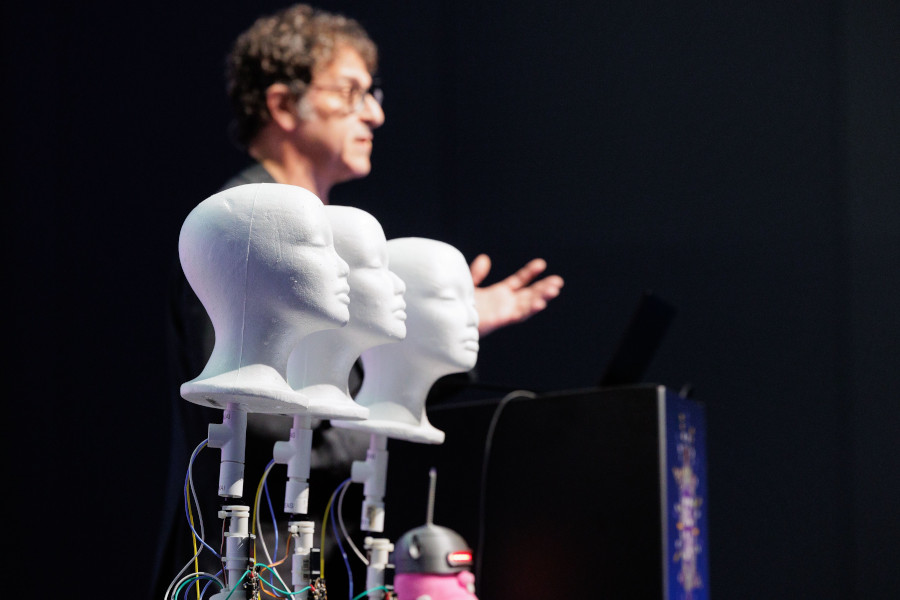
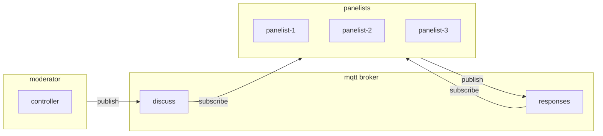
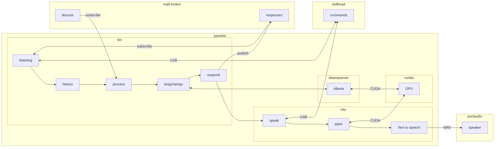
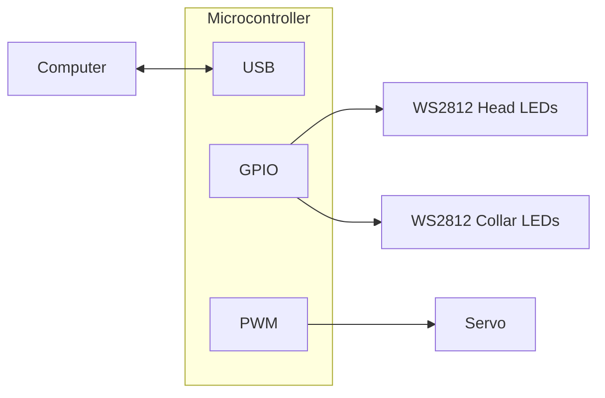
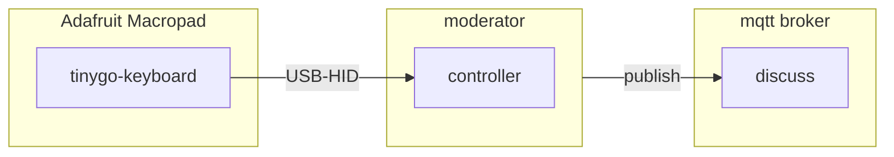

# Talking Heads From The Year 2053



Demonstration from opening keynote at Gophercon 2024.

## Starting everything

```shell
./start.sh
tmuxinator s talkingheads-serial -p ./talkingheads-serial.yml
```

## Architecture

### Overview



### Panelist



### Dollhead



### Moderator




## Model server

Start ollama

```shell
docker run --gpus=all -d -v ${HOME}/.ollama:/root/.ollama -v ${HOME}/ollama-import:/root/ollama-import -p 11434:11434 --name ollama ollama/ollama:latest
```

Stop ollama

```shell
docker stop ollama
```

Subsequent starts

```shell
docker start ollama
```

### Models

Download models

```shell
docker exec ollama ollama run llama3
docker exec ollama ollama run phi3
docker exec ollama ollama run gemma2
```

### Importing models

```shell
docker exec ollama ollama create "Phi-3-mini-128k-instruct-abliterated-v3_q8" -f phi3-mini-modelfile
```

Uncensored models

https://huggingface.co/Orenguteng/Llama-3-8B-Lexi-Uncensored-GGUF

```
FROM /root/ollama-import/Lexi-Llama-3-8B-Uncensored_Q4_K_M.gguf
TEMPLATE "
{{ if .System }}<|start_header_id|>system<|end_header_id|>
{{ .System }}<|eot_id|>{{ end }}{{ if .Prompt }}<|start_header_id|>user<|end_header_id|>
{{ .Prompt }}<|eot_id|>{{ end }}<|start_header_id|>assistant<|end_header_id|>
{{ .Response }}<|eot_id|>
"
PARAMETER num_keep 24
PARAMETER stop <|start_header_id|>
PARAMETER stop <|end_header_id|>
PARAMETER stop <|eot_id|>
```

https://huggingface.co/failspy/Phi-3-mini-128k-instruct-abliterated-v3-GGUF/blob/main/Phi-3-mini-128k-instruct-abliterated-v3_q8.gguf

```
FROM /root/ollama-import/Phi-3-mini-128k-instruct-abliterated-v3_q8.gguf

TEMPLATE """<|im_start|>system
{{ .System }}<|im_end|>
<|im_start|>user
{{ .Prompt }}<|im_end|>
<|im_start|>assistant
"""

PARAMETER stop "<|im_start|>"
PARAMETER stop "<|im_end|>"
```

## MQTT broker

```shell
docker run -d --network host eclipse-mosquitto
```

## TTS Engine

https://github.com/rhasspy/piper

- download binary
- add to path
- download voices to `./voices`

## Panelist

```shell
cd cmd
go run ./panelist/ -l="en-US" -voice="hfc_female-medium" -data="../voices" -tts-engine="piper" -model="llama3" -name="llama" -server="localhost:1883"
```

```shell
cd cmd
go run ./panelist/ -l="en-US" -voice="hfc_female-medium" -data="../voices" -tts-engine="piper" -speak="Hello, there!"
```

## Moderator

```shell
go run ./moderator/ -server="localhost:1883"
```

## License

Copyright 2023-2024 The Hybrid Group.

Other included content copyright of their respective holders.
