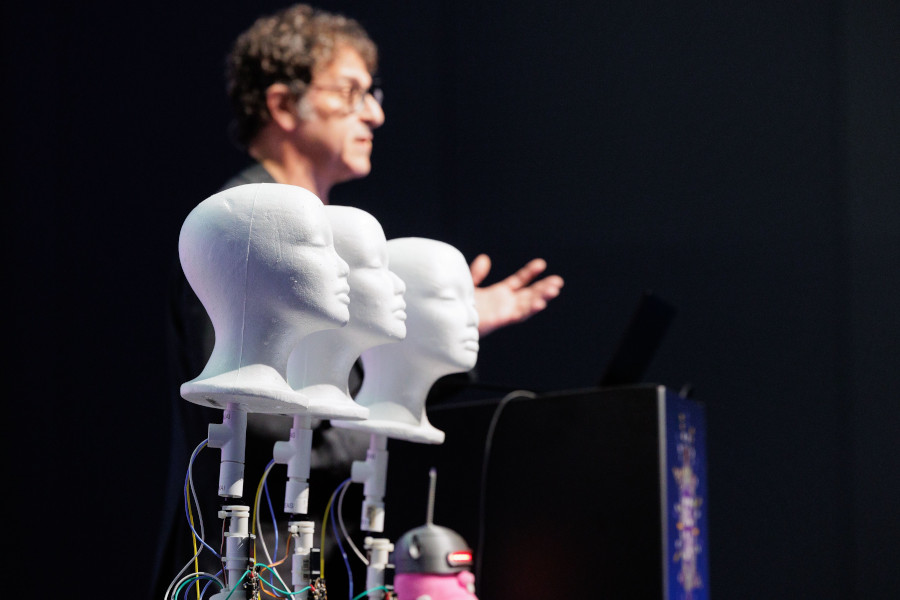
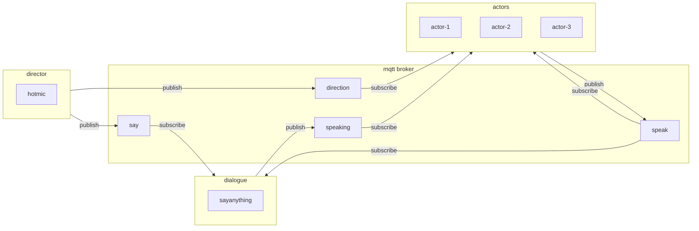
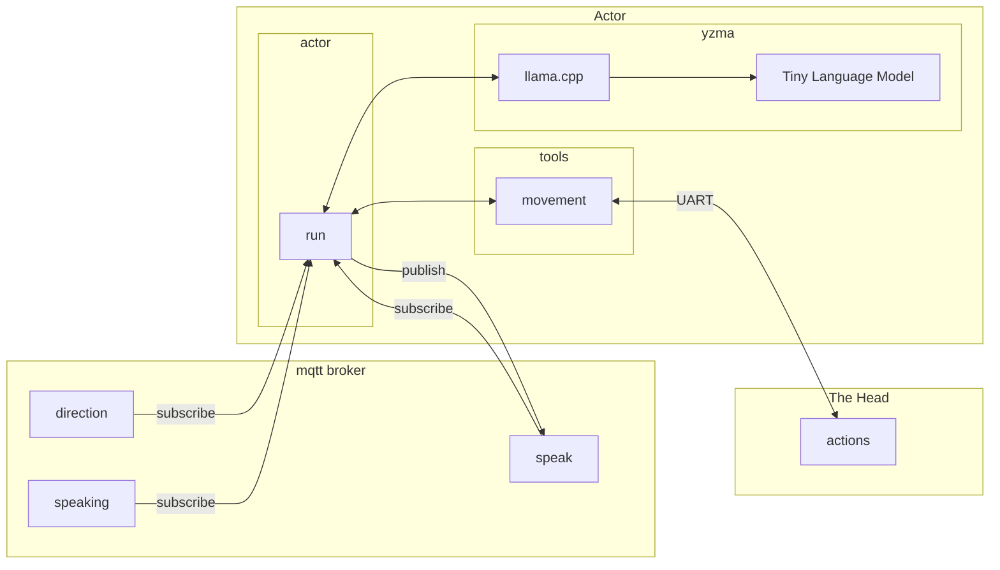
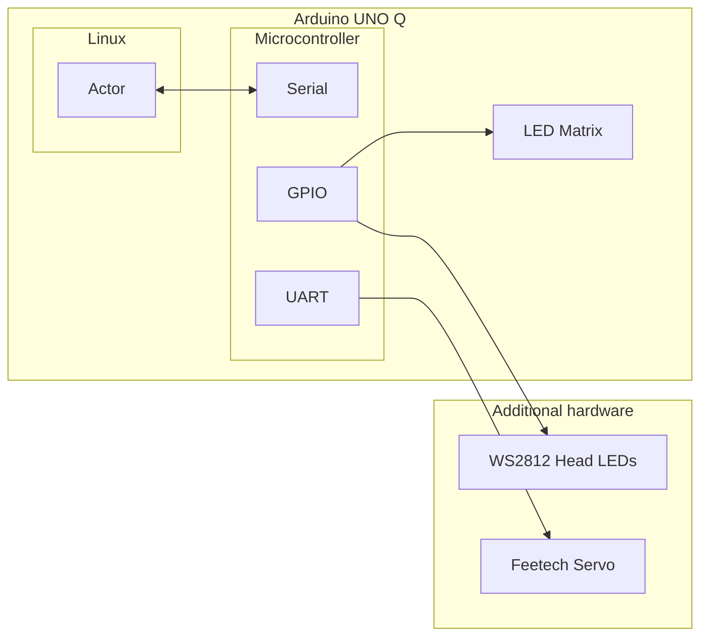
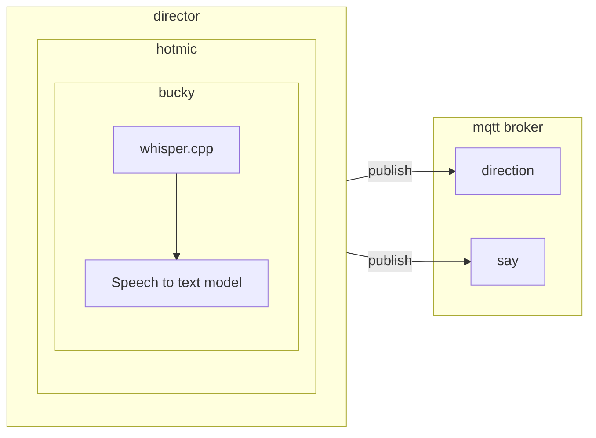
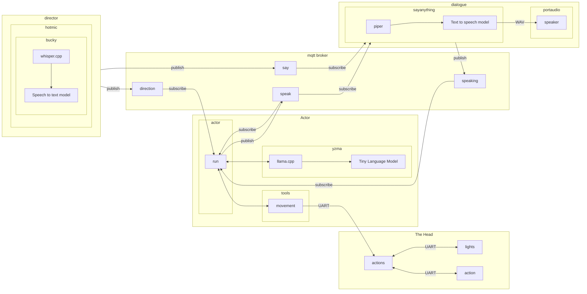

# Talking Heads From The Year 2053



A Fantastical Interaction Between Machines From The Future and Their Pet Human

## Architecture

### Overview


```mermaid
flowchart LR
subgraph mqtt broker
    direction
    speak
    say
    speaking
end
subgraph actors
    actor-1
    actor-2
    actor-3
end
subgraph director
    hotmic
end
subgraph dialogue
    sayanything
end
director -- publish --> direction
director -- publish --> say
direction-- subscribe -->actors
actors-- publish -->speak
speak-- subscribe -->actors
speak-- subscribe -->dialogue
say-- subscribe -->dialogue
dialogue-- publish -->speaking
speaking-- subscribe -->actors
```

### Actor

Actor runs on the Linux part of an Arduino UNO Q board. It is written in Go with [yzma](https://github.com/hybridgroup/yzma) to perform local inference using [llama.cpp](https://github.com/ggml-org/llama.cpp). It communicates with other Actors by publishing and subscribing to [MQTT](https://mqtt.org/) messages.


```mermaid
flowchart LR
subgraph mqtt broker
    direction
    speak
    speaking
end
subgraph Actor
    subgraph actor
        run
    end
    subgraph tools
        run<-->movement
    end
    subgraph yzma
        run<-->llama.cpp
        llama.cpp-->model[Tiny Language Model]
    end
    direction-- subscribe -->run
    run-- publish -->speak
    speak-- subscribe -->run
    speaking-- subscribe -->run
end
subgraph The Head
    movement<-- UART -->actions
end
```

### The Head

The Head is controlled by the STM32 microcontroller of an Arduino UNO Q board using the `action` firmware written using TinyGo. Actor communicates with The Head using the onboard serial port between the microcontroller and the main processor running on the same Arduino UNO Q board.


```mermaid
flowchart LR
subgraph Arduino UNO Q
    subgraph Microcontroller
        Serial
        GPIO
        UART
    end
    GPIO --> LEDMatrix[LED Matrix]
    subgraph Linux
        Actor<-->Serial
    end
end
subgraph Additional hardware
    GPIO --> WS2812Head[WS2812 Head LEDs]
    UART --> Servo[Feetech Servo]
end
```

### Director

Director runs on a separate computer that is connected to the same local network as the MQTT broker. It uses [ardanlabs/bucky](https://github.com/ardanlabs/bucky) with a local [whisper.cpp](https://github.com/ggml-org/whisper.cpp) shared library to perform "push to talk" to communicate with Actors.


```mermaid
flowchart LR
subgraph mqtt broker
    direction
    say
end
subgraph director
    hotmic
end
subgraph hotmic
    subgraph bucky
        whisper.cpp
        whisper.cpp-->stt[Speech to text model]
    end
end
director -- publish --> direction
director -- publish --> say
```

### Dialogue

Dialogue runs on a separate computer that is connected to the same local network as the MQTT broker. It uses the [sayanything](https://github.com/hybridgroup/go-sayanything) package with the [Piper](https://github.com/rhasspy/piper) Text To Speech engine to create audio output for everything said by Actors.


```mermaid
flowchart LR
subgraph mqtt broker
    speak
    say
    speaking
end
subgraph dialogue
    speak-- subscribe -->sayanything
    say-- subscribe -->sayanything
    subgraph sayanything
        piper-->tts[Text to speech model]
    end
    subgraph portaudio
        tts-- WAV -->speaker
    end
    sayanything-- publish -->speaking
end
```

### Detail


```mermaid
flowchart LR
subgraph The Head
    actions<-- UART -->lights
    actions<-- UART -->action
end
subgraph mqtt broker
    direction
    speak
    say
    speaking
end
subgraph Actor
    subgraph actor
        run
    end
    subgraph tools
        run<-->movement
        movement-- UART -->actions
    end
    subgraph yzma
        run<-->llama.cpp
        llama.cpp-->model[Tiny Language Model]
    end
    direction-- subscribe -->run
    run-- publish -->speak
    speak-- subscribe -->run
    speaking-- subscribe -->run
end
subgraph dialogue
    speak-- subscribe -->sayanything
    say-- subscribe -->sayanything
    subgraph sayanything
        piper-->tts[Text to speech model]
    end
    subgraph portaudio
        tts-- WAV -->speaker
    end
    sayanything-- publish -->speaking
end
subgraph director
    hotmic
end
subgraph hotmic
    subgraph bucky
        whisper.cpp
        whisper.cpp-->stt[Speech to text model]
    end
end
director -- publish --> direction
director -- publish --> say
```

## Models

More info soon...

## MQTT broker

```shell
docker run -d --network host eclipse-mosquitto
```

## Piper TTS Engine

https://github.com/OHF-Voice/piper1-gpl

- download binary
- add to path
- download voices to `./voices`
